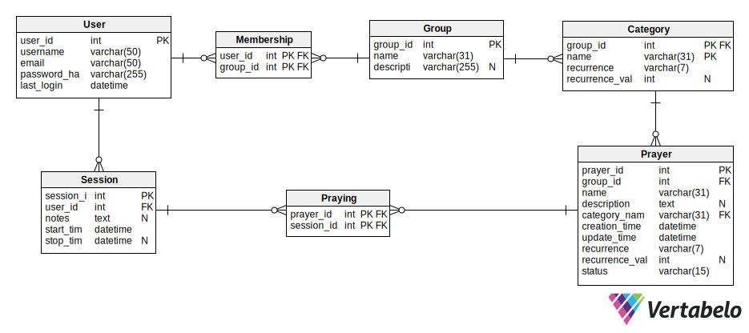
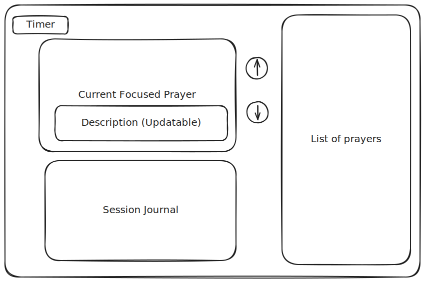

# Prayer Journaling App
## Run
## Database Diagram

## Session Wireframe

## Functionality
 - When a user creates an account, there is a personal group that is created.
 - A group can have categories that are associated with it to divide up the group.
 - When a group is created it is populated with some default categories (Personal, Church, Outreach, Special Needs)
 - A user is able to create more groups and then add people to those groups
 - Within a group, Users can create more categories
 - Within a category, Users can create prayers
 - A prayer will have a frequency associated with it. The frequency can either be daily, weekly ( a certain day of the week (sun-sab) ), or monthly ( a day of the month (1-31) )
 - When you pray, the daily prayers will be placed in the session. They can be then added or removed from the session.

 - **Note:** Due to lack of time, everyone is a "group administrator" for the groups they are members of, ie. they can do CRUD on the group and add and remove members as they please.
## Todo
 - [ ] Setup Databases with Migrations
 - [ ] Identity Authentication
 - [ ] Login/Signup Page
 - [ ] Home Page
    - [ ] Start prayer
    - [ ] List groups
    - [ ] Display prayers for personal group
 - [ ] CRUD Prayer
 - [ ] CRUD Groups
 - [ ] CRUD Categories
 - [ ] CRUD Membership within Groups
    - This will happen on a group page
 - [ ] CRUD Session
    - Timer
    - Way to add prayers to the session
    - Notes section

## Future Improvements
 - [ ] Use the [Secrets Manager](https://learn.microsoft.com/en-us/aspnet/core/security/app-secrets?view=aspnetcore-9.0&tabs=linux) tool to store the connection string in a secure manner
 - [ ] Create roles for each user when they are a part of a group (admin, member)
    - [ ] Admin: Can do everything (CRUD Group/Prayers/Categories, Add/Remove Members)
    - [ ] Member: Can CR(UD) Own Prayers, Read Categories/Other's prayers, Must use provided categories
 - [ ] Set the frequency to multiple days per week
